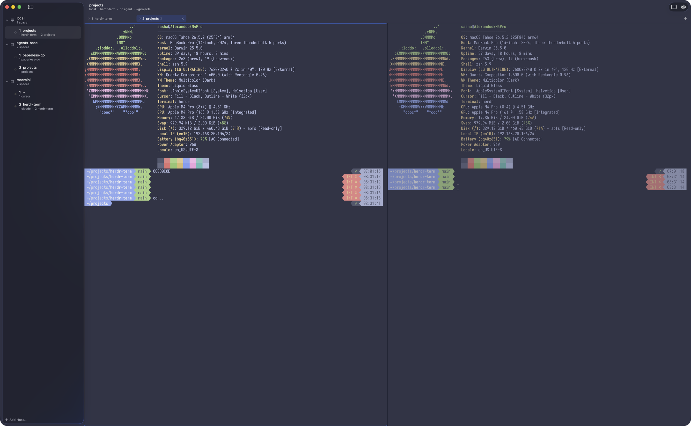

# Herdglass

Native macOS GUI client for remote [Herdr](https://herdr.dev) servers, with a GPU terminal via [libghostty](https://github.com/ghostty-org/ghostty), attention rings when an agent is `blocked` or has an unseen `done`, and macOS notifications for the ones you are not looking at.



The window maps straight onto Herdr's own structure:

| Chrome | Herdr |
| --- | --- |
| Sidebar folders | hosts / connections — several can be attached at once |
| Folder children | spaces (Herdr workspaces) |
| Strip above the terminal | the space's tabs |
| The terminal area | the tab's panes, drawn as splits |

Herdr remains the multiplexer; this app does not reimplement panes, agents, or layouts. Splitting, closing and resizing all happen on the server, and the GUI redraws what the server reports — so the same session looks the same in `herdr`'s TUI.

## Requirements

- macOS 14+, Apple Silicon (libghostty is built for the host, so arm64 here)
- Local `herdr` on `PATH` (tested with 0.8.2)
- For remote hosts: working OpenSSH (`ssh <host>` already succeeds) and the key loaded in `ssh-agent` (`ssh-add -l`)
- To build libghostty: Xcode, its Metal toolchain (`xcodebuild -downloadComponent MetalToolchain`, ~700 MB, once per Xcode) and the ghostty checkout. Zig is downloaded for you at the version ghostty pins.

## Build libghostty

libghostty is not a package dependency: it is built here from the `ghostty`
commit pinned in `Vendor/ghostty`, and the resulting xcframework is not in git.
Once per clone, and again whenever that pin moves:

```bash
git submodule update --init Vendor/ghostty
./Scripts/libghostty.sh
```

That takes a while — it compiles ghostty with `-Doptimize=ReleaseFast` — and
leaves `Vendor/GhosttyKit.xcframework` plus a `Vendor/libghostty.version` note
of what it was built from. Neither is in git — the pin is the `Vendor/ghostty`
gitlink, and those two are what your machine made of it.
`Scripts/libghostty.sh --check` says whether the artifact still matches the pin;
`dev.sh` and `release.sh` run it first and stop if it does not.

## Run

```bash
chmod +x Scripts/dev.sh
./Scripts/dev.sh --run
```

`--run` starts the app from your shell so `SSH_AUTH_SOCK` is inherited. Double-clicking the `.app` (or `open`) often cannot talk to `ssh-agent`.

Or `swift run Herdglass`.

For a build you keep around, `Scripts/release.sh` compiles with optimizations and
stamps the commit into `CFBundleVersion`; `--install` copies it to `/Applications`:

```bash
./Scripts/release.sh --install
```

It is ad-hoc signed for this Mac only — not notarized, so it is not something to
hand to anyone else.

Connect with an SSH config Host (the same target you would pass to `herdr --remote workbox`), `ssh://user@host:22`, or `local` to attach to a Herdr server on this Mac. The optional session name matches `herdr --remote host --session agents`.

Hosts you have used before are listed in the sidebar, dimmed, on the next launch; clicking one attaches it. ⌘K adds another host to the same window rather than replacing the current one, and each host keeps its own connection, spaces and selection. Right-click a folder for New Space, Reconnect, Disconnect and Remove Host.

To skip the connect sheet, name the target on the command line:

```bash
./Scripts/dev.sh --run --connect workbox --session agents
```

## App icon

The icon is drawn, not stored: `Scripts/appicon.swift` renders it with
CoreGraphics and writes `Resources/Herdglass.icns`, which the build scripts copy
into the bundle. The `.icns` is in git, so a normal build never runs the script —
only a change to the design does:

```bash
./Scripts/appicon.swift            # rewrite Resources/Herdglass.icns
./Scripts/appicon.swift --png /tmp/icon.png   # and a 1024px PNG to look at
```

It is a lead ghost at a `>_` prompt with a small herd behind it, the followers in
the two colours `StatusStyle` gives a pane that wants looking at — orange for
`blocked`, blue for an unseen `done`. The bezel-and-phosphor look is a nod to
libghostty doing the rendering; the artwork is this project's own.

The art fills the canvas edge to edge rather than leaving the usual margin,
because macOS 26 masks a legacy `.icns` to the icon shape and casts the shadow
itself — art that reserves its own margin gets inset twice and comes out half
size. It still draws its own rounded shape, which is what keeps it looking like
an icon on macOS 14 and 15, where nothing masks it.

## How remote attach works

`herdr --remote` is **TUI-only** (`herdr --remote HOST workspace list` is rejected). Non-interactive SSH also skips zsh/Homebrew `PATH`, so Herdglass looks for `/opt/homebrew/bin/herdr` (and a few other install locations) on the remote host. It then:

1. Opens an SSH ControlMaster to the target (`BatchMode`, so keys must already be in the agent)
2. Ensures `herdr server` is running on the remote host (installs nothing; the binary must already be there)
3. Forwards the remote Unix API socket advertised by `herdr status server`
4. Speaks Herdr's NDJSON socket API (`session.snapshot`, `events.subscribe`, `pane.focus`)
5. Renders every pane of the selected tab by spawning one `Herdglass --bridge --target <pane> …` per pane, each running `herdr terminal session control <pane> --takeover` and copying `terminal.frame` ANSI bytes into libghostty
6. Reads the tab's split tree from `layout.export` and builds it out of nested split views; dragging a divider sends `layout.set_split_ratio`

Frame / control JSON (Herdr 0.8.2):

- `{ "type": "terminal.frame", "bytes": "<base64>", "encoding": "ansi", "full": true, "width": 80, "height": 24, "seq": 1 }`
- `{ "type": "terminal.input", "bytes": "<base64>" }` or `{ "type": "terminal.input", "text": "..." }` (not both)
- `{ "type": "terminal.resize", "cols": 80, "rows": 24 }`
- `{ "type": "terminal.scroll", "direction": "up" | "down", "lines": 3, "source": "wheel" | "page_key" }`
- `{ "type": "terminal.release" }`

Requests on the API socket are **one-shot**: Herdr answers a single request and closes the connection. Only `events.subscribe` stays open and streams.

Only the selected tab of the selected host is rendered, so only its panes hold bridges — switching tabs or hosts releases the previous ones.

## Notifications

An agent that asks for input or finishes in a pane you are not looking at — a
different tab, a different space, a different host — posts a macOS notification:
the pane's name, the host and space it is in, and what it wants. Opening the
notification selects that pane, dialling the host and switching space and tab to
get there. Seeing the pane withdraws the notification again, the same moment the
sidebar's unread mark clears, so Notification Center never holds a request you
have already answered.

This is Herdr's own notion of a notification — what `[ui.toast] delivery` in
`config.toml` delivers as a TUI toast — taken by the client that has an OS to
hand it to. Turn it off in **Herdglass → Settings…**.

## Settings

Two things, because they are the two that neither ghostty nor Herdr can state:

- **Interface text size** — how big this app draws its own chrome: the sidebar,
  the tab strip, the labels around a terminal. The terminal's font is still
  `font-size` in your ghostty config. Every step applies at once, everywhere.
- **Notifications** — the switch described above.

Anything that describes a *terminal* belongs in the ghostty config, and anything
that describes a *pane* belongs to the Herdr server.

## Hosts come back

The hosts that were attached when you last quit are dialled again at launch — so
a restart comes back to the sessions it left rather than to a sidebar of dimmed
rows. A host leaves that list when you detach it yourself (**Disconnect**, or
**Remove Host**); closing the window and quitting do not count, which is the
whole point. Every other remembered host stays parked until you pick it.

There is one window, and one app. A second copy — `open -n`, or the binary run
straight out of `.build` — brings the one already running to the front and
exits rather than starting a rival: both would dial the same hosts, and every
host would end up with two SSH masters and two sets of bridges for the same
panes.

## Your ghostty config

The terminal is libghostty, so it already reads `~/.config/ghostty/config` (or
`~/Library/Application Support/com.mitchellh.ghostty/config`) for fonts, colours,
themes and everything it renders. Herdglass reads the rest of that file too, for
the settings that describe a window rather than a terminal — you configure this
app by configuring ghostty:

| Key | What it does here |
| --- | --- |
| `background`, `foreground` | The colour behind a terminal, and the text on the placeholders that sit there |
| `background-opacity`, `background-blur` | A translucent, blurred window — the whole window, not just the surface |
| `split-divider-color` | The divider between panes of a split (derived from `background` when unset, as in ghostty) |
| `unfocused-split-opacity`, `unfocused-split-fill` | Dims the panes of a split that do not have the keyboard |
| `window-theme` | Light or dark chrome. `auto`, the default, matches the chrome to the terminal background — so a dark terminal gets a dark sidebar |
| `macos-titlebar-style` | `native`, or a transparent titlebar in the terminal's colour (`tabs` and `hidden` both read as transparent; the window needs its toolbar) |
| `macos-window-buttons`, `macos-window-shadow` | Traffic lights, window shadow |
| `title` | A fixed window title instead of the selected pane's |
| `window-save-state` | `never` stops the window remembering its position |
| `confirm-close-surface` | `false` never asks before closing a tab, `always` always does |
| `focus-follows-mouse` | Hovering a pane of a split moves the keyboard into it |
| `keybind` | Moves this app's menu shortcuts. `new_tab`, `close_surface`, `close_tab`, `close_window`, `quit`, `new_split:right`/`:down`, `goto_split:left`/`right`/`up`/`down`, `next_tab`, `previous_tab`, `goto_tab:1`…`9`, `reload_config`, `open_config`, `toggle_fullscreen`, `select_all`, `copy_to_clipboard`, `paste_from_clipboard` |

To see exactly what arrived:

```bash
swift build --product Herdglass && .build/debug/Herdglass --show-ghostty-config
```

Anything ghostty owns that Herdr owns here instead — splits, zoom, scrollback,
tab order — is not read: the server decides those, and the GUI asks it to.
`mouse-scroll-multiplier` and `quit-after-last-window-closed` are also skipped;
`AGENTS.md` says why.

Changing the config takes effect on **Reload Terminal Config** (`⇧⌘,` by
default) — colours, window chrome and menu shortcuts all re-read.

## Shortcuts

Defaults, and all of them movable with `keybind` (see above).

| Key | Action |
| --- | --- |
| `⌘K` | Add host… |
| `⌘R` | Reconnect the selected host |
| `⌘T` | New tab in the selected space |
| `⌘W` | Close: the pane, in a split; the tab, when the tab has one pane |
| `⌥⌘W` | Close tab, split or not (`⇧⌘W` closes the window, and the app) |
| `⌘D` / `⇧⌘D` | Split the active pane right / down |
| `⇧⌘←↑↓→` | Move the keyboard to the pane in that direction |
| `⌘1`…`⌘9` | Tab with that number, in the selected space |
| `⌃⌘1`…`⌃⌘9` | Space with that number |
| `⌥⌘←` / `⌥⌘→` | Previous / next tab |
| `⌥⌘↑` / `⌥⌘↓` | Previous / next space, down the whole sidebar (hosts included) |
| `⇧⌘U` | Jump to the pane that needs attention (any host) |
| `⌃⌘S` | Toggle sidebar |
| `⌃⌘F` | Full screen |
| `⌘,` / `⇧⌘,` | Open / reload the ghostty config |

`⌘,` is ghostty's own `open_config` binding, and this app honours it. Settings —
the app's own window, with the notification switch — is in the Herdglass menu,
and takes `⌘,` only if your ghostty config points `open_config` somewhere else.

Clicking a pane moves the keyboard into it — that is also how the active pane of a split changes, and Herdr is told about it. Arrow keys browse the sidebar without stealing focus. The sidebar is draggable between 180 and 460 pt and its width is remembered.

⌘W closes what is in front of you, the way ghostty's `close_surface` does: the
focused pane when the tab is split, and the tab itself when it is not. ⌥⌘W closes
the whole tab either way. Both ask first when there is more than a bare shell to
lose, because `pane.close` and `tab.close` really do close panes on the server —
`confirm-close-surface` in your ghostty config changes that to never or always.

Scrolling the pane scrolls Herdr's scrollback, not a local copy: the wheel becomes a `terminal.scroll` on the server, which then sends the frame for the new viewport.

## Command line

| Flag | Meaning |
| --- | --- |
| `--connect <host> [--session <name>]` | Open a window straight onto a host |
| `--self-test <host> [--session <name>]` | Connect, snapshot, read one control frame, exit |
| `--show-ghostty-config` | Print the ghostty settings this app honours, and the menu they produced |
| `--bridge --target <pane>` | Internal: the PTY child libghostty spawns for a pane (one per visible pane) |

## License

[Business Source License 1.1](LICENSE) — source available, not open source. Non-production use is
free; production use is allowed too, except for shipping it as a competing commercial terminal,
multiplexer, or remote-session product. Each version converts to the MIT License on 2030-08-21,
or four years after that version was first published, whichever comes first.

Ghostty/libghostty and GhosttyKit stay MIT under their own terms — see
[THIRD-PARTY-NOTICES.md](THIRD-PARTY-NOTICES.md). This repo does not vendor
[cmux](https://github.com/manaflow-ai/cmux) (AGPL).
